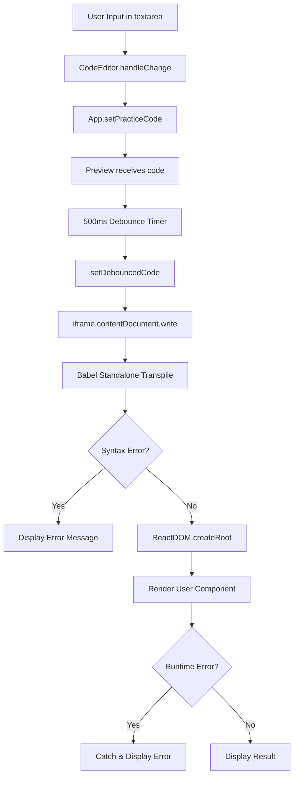
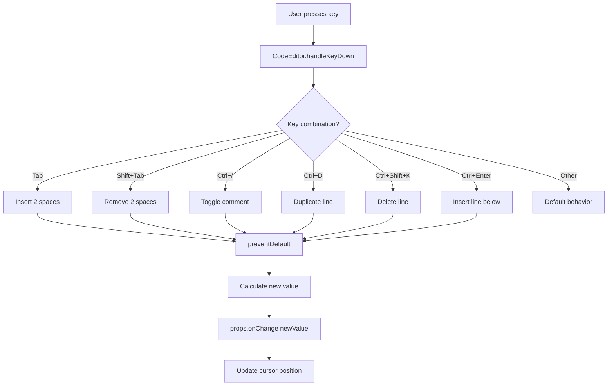

# React Sandbox - 基本設計書

## 1. システム概要

### 1.1 目的
React を静的環境で練習できるブラウザベースの Sandbox アプリケーション。
ユーザーが React コンポーネントをブラウザ上で編集し、リアルタイムでプレビューできる学習環境を提供する。

### 1.2 主要機能
- コードエディタ（VSCode 風ショートカット搭載）
- リアルタイムプレビュー（デバウンス処理あり）
- お手本コード表示機能
- リサイザブル 2 分割レイアウト
- レスポンシブ対応（デスクトップ/タブレット/モバイル）
- タッチデバイス対応

### 1.3 ターゲットユーザー
- React 初学者
- React の動作を手軽に確認したい開発者
- プログラミング学習者

---

## 2. アーキテクチャ設計

### 2.1 全体アーキテクチャ

```
┌─────────────────────────────────────────────────────────┐
│                    Browser (Client)                      │
│  ┌────────────────────────────────────────────────────┐ │
│  │              React Application                      │ │
│  │  ┌──────────────┐  ┌──────────────────────────┐   │ │
│  │  │  App.tsx     │  │   Components Layer        │   │ │
│  │  │  (Root)      │──│  - CodeEditor             │   │ │
│  │  │              │  │  - Preview                │   │ │
│  │  │  State:      │  │  - PreviewSection         │   │ │
│  │  │  - code      │  │  - ReadOnlyEditor         │   │ │
│  │  │  - isMobile  │  └──────────────────────────┘   │ │
│  │  └──────────────┘                                  │ │
│  │                                                     │ │
│  │  ┌──────────────────────────────────────────────┐ │ │
│  │  │     react-resizable-panels (UI Library)      │ │ │
│  │  │  - PanelGroup (レイアウト管理)               │ │ │
│  │  │  - Panel (エリア分割)                        │ │ │
│  │  │  - PanelResizeHandle (リサイザー)            │ │ │
│  │  └──────────────────────────────────────────────┘ │ │
│  └────────────────────────────────────────────────────┘ │
│                                                           │
│  ┌────────────────────────────────────────────────────┐ │
│  │         Sandboxed iframe (Execution Layer)         │ │
│  │  ┌──────────────────────────────────────────────┐ │ │
│  │  │  - Babel Standalone (JSX → JS)               │ │ │
│  │  │  - React 18 (runtime)                        │ │ │
│  │  │  - ReactDOM 18 (rendering)                   │ │ │
│  │  │  - User Code (isolated execution)            │ │ │
│  │  └──────────────────────────────────────────────┘ │ │
│  └────────────────────────────────────────────────────┘ │
└─────────────────────────────────────────────────────────┘
```

### 2.2 レイヤー構成

#### プレゼンテーション層
- **責務**: UI の描画、ユーザーインタラクションの処理
- **主要コンポーネント**: App, CodeEditor, Preview, PreviewSection

#### ビジネスロジック層
- **責務**: アプリケーションロジック、状態管理
- **実装**: React Hooks (useState, useEffect, useRef)

#### 実行層
- **責務**: ユーザーコードの安全な実行
- **実装**: iframe + Babel Standalone

---

## 3. 技術選定理由

### 3.1 フレームワーク・ライブラリ

| 技術 | 選定理由 |
|------|---------|
| **React 18** | - 宣言的 UI 構築が可能<br>- 豊富なエコシステム<br>- Hooks による状態管理<br>- 学習用アプリとして適切 |
| **TypeScript** | - 型安全性<br>- IDE サポート充実<br>- 保守性向上<br>- エラーの早期発見 |
| **Vite** | - 高速な開発サーバー<br>- 効率的なバンドリング<br>- TypeScript サポート<br>- 小規模プロジェクトに最適 |
| **react-resizable-panels** | - プロダクショングレードの堅牢性<br>- アクセシビリティサポート<br>- タッチデバイス対応<br>- 自前実装より信頼性が高い |

### 3.2 テスト・CI/CD

| 技術 | 選定理由 |
|------|---------|
| **Vitest** | - Vite との統合が容易<br>- Jest 互換 API<br>- 高速な実行<br>- ESM サポート |
| **React Testing Library** | - ユーザー視点のテスト<br>- ベストプラクティスに準拠<br>- React 公式推奨 |
| **GitHub Actions** | - GitHub との統合<br>- 無料枠が充実<br>- 設定が簡単 |
| **GitHub Pages** | - 静的ホスティング無料<br>- 自動デプロイ<br>- HTTPS 対応 |

---

## 4. コンポーネント設計

### 4.1 コンポーネント階層

```
App (Container Component)
├── Header (Presentational)
└── PanelGroup (Library Component)
    ├── Panel (エディタ側)
    │   └── CodeEditor (Smart Component)
    │       ├── Header (Presentational)
    │       └── Content (Presentational)
    │           ├── Textarea (Native)
    │           └── Overlay (Presentational)
    ├── PanelResizeHandle (Library Component)
    └── Panel (プレビュー側)
        └── PreviewSection (Smart Component)
            └── Preview (Smart Component)
                └── iframe (Native)
```

### 4.2 コンポーネント詳細設計

#### App (src/App.tsx)

**役割**: ルートコンポーネント、状態管理、レイアウト制御

**Props**: なし

**State**:
```typescript
{
  practiceCode: string      // ユーザーが入力したコード
  isMobile: boolean         // モバイルレイアウトかどうか
}
```

**ライフサイクル**:
1. マウント時: 画面サイズを判定してモバイルフラグを設定
2. window resize イベントを監視
3. アンマウント時: イベントリスナーをクリーンアップ

**依存**:
- react-resizable-panels: PanelGroup, Panel, PanelResizeHandle
- CodeEditor
- PreviewSection

---

#### CodeEditor (src/components/CodeEditor.tsx)

**役割**: コード入力、VSCode 風ショートカット、お手本表示

**Props**:
```typescript
interface CodeEditorProps {
  value: string                    // 現在のコード
  onChange: (value: string) => void // コード変更時のコールバック
  title?: string                    // エディタのタイトル（デフォルト: "練習エディタ"）
  exampleCode?: string              // お手本コード
}
```

**State**:
```typescript
{
  showOverlay: boolean  // お手本表示の ON/OFF
}
```

**Ref**:
```typescript
{
  textareaRef: RefObject<HTMLTextAreaElement>  // textarea の DOM 参照
}
```

**イベントハンドラー**:
- `handleChange`: テキスト変更
- `toggleOverlay`: お手本表示切り替え
- `handleKeyDown`: キーボードショートカット処理
  - Tab: インデント追加
  - Shift+Tab: インデント削除
  - Ctrl+/: コメントアウト/解除
  - Ctrl+D: 行の複製
  - Ctrl+Shift+K: 行の削除
  - Ctrl+Enter: 下に行を挿入

**レンダリング**:
```jsx
<div className="code-editor">
  <Header>
    <Title>{title}</Title>
    {exampleCode && <OverlayButton onClick={toggleOverlay} />}
  </Header>
  <Content>
    <Textarea
      ref={textareaRef}
      value={value}
      onChange={handleChange}
      onKeyDown={handleKeyDown}
    />
    {showOverlay && exampleCode && (
      <Overlay>
        <Pre>{exampleCode}</Pre>
      </Overlay>
    )}
  </Content>
</div>
```

---

#### Preview (src/components/Preview.tsx)

**役割**: コードのプレビュー表示、デバウンス処理、iframe 管理

**Props**:
```typescript
interface PreviewProps {
  code: string     // 実行するコード
  error?: string   // エラーメッセージ
}
```

**State**:
```typescript
{
  debouncedCode: string  // デバウンス処理されたコード
}
```

**Ref**:
```typescript
{
  iframeRef: RefObject<HTMLIFrameElement>  // iframe の DOM 参照
}
```

**エフェクト**:
1. **デバウンス処理** (useEffect):
   - code が変更されたら 500ms のタイマーをセット
   - タイマー終了後に debouncedCode を更新
   - code が再度変更されたらタイマーをクリア

2. **iframe 更新** (useEffect):
   - debouncedCode が変更されたら iframe の内容を更新
   - Babel Standalone で JSX をトランスパイル
   - ReactDOM.createRoot でレンダリング
   - エラーが発生したら catch してエラー表示

**iframe 内の HTML 構造**:
```html
<!DOCTYPE html>
<html>
  <head>
    <script src="https://unpkg.com/react@18/umd/react.production.min.js"></script>
    <script src="https://unpkg.com/react-dom@18/umd/react-dom.production.min.js"></script>
    <script src="https://unpkg.com/@babel/standalone/babel.min.js"></script>
  </head>
  <body>
    <div id="root">Loading...</div>
    <script type="text/babel">
      // User code here
    </script>
  </body>
</html>
```

---

## 5. 状態管理設計

### 5.1 状態の種類

#### ローカル状態 (useState)
| コンポーネント | 状態 | 用途 |
|--------------|------|------|
| App | practiceCode | ユーザーが入力したコード |
| App | isMobile | モバイルレイアウトフラグ |
| CodeEditor | showOverlay | お手本表示の ON/OFF |
| Preview | debouncedCode | デバウンス処理されたコード |

#### Props によるデータフロー
```
App.practiceCode
  ↓ (props: value)
CodeEditor
  ↓ (onChange)
App.practiceCode (更新)
  ↓ (props: code)
PreviewSection → Preview
  ↓ (useEffect)
debouncedCode (500ms 後)
  ↓ (useEffect)
iframe 内で実行
```

### 5.2 状態更新フロー

#### コード入力時
```
1. User types in textarea
   ↓
2. CodeEditor.handleChange
   ↓
3. props.onChange(newValue)
   ↓
4. App.setPracticeCode(newValue)
   ↓
5. Re-render CodeEditor & PreviewSection
   ↓
6. Preview receives new code prop
   ↓
7. Debounce timer starts (500ms)
   ↓
8. Timer completes → setDebouncedCode
   ↓
9. iframe updates with new code
```

#### リサイズ時
```
1. User drags PanelResizeHandle
   ↓
2. react-resizable-panels handles event
   ↓
3. Panel sizes update (internal state)
   ↓
4. Components re-render with new sizes
```

#### レスポンシブ切り替え時
```
1. window.resize event fires
   ↓
2. checkMobile() calculates width
   ↓
3. setIsMobile(newValue)
   ↓
4. PanelGroup direction changes
   ↓
5. Layout re-flows
```

---

## 6. データフロー設計

### 6.1 コード実行フロー



### 6.2 VSCode 風ショートカットフロー



---

## 7. セキュリティ設計

### 7.1 脅威モデル

| 脅威 | 対策 | 実装 |
|------|------|------|
| XSS 攻撃 | iframe 分離 | `sandbox="allow-scripts allow-same-origin"` |
| 無限ループ | なし（意図的） | ユーザーの学習のため制限なし |
| localStorage アクセス | 同一オリジン | allow-same-origin で制限 |
| ポップアップスパム | 禁止 | sandbox 属性で allow-popups なし |
| フォーム送信 | 禁止 | sandbox 属性で allow-forms なし |

### 7.2 iframe サンドボックス設定

```html
<iframe
  sandbox="allow-scripts allow-same-origin"
  title="Preview"
/>
```

**許可事項**:
- `allow-scripts`: JavaScript 実行（React の動作に必要）
- `allow-same-origin`: 同一オリジン API アクセス（React の動作に必要）

**制限事項**:
- フォーム送信不可
- ポップアップ不可
- トップレベルナビゲーション不可
- ポインターロック不可

### 7.3 エラーハンドリング

```javascript
try {
  // User code execution
  const root = ReactDOM.createRoot(rootElement);
  root.render(React.createElement(App));
} catch (err) {
  // Safe error display
  rootEl.innerHTML =
    '<div style="color: red; padding: 16px; white-space: pre-wrap;">' +
    'エラー: ' + err.message + '\n\n' + err.stack +
    '</div>';
}
```

---

## 8. パフォーマンス設計

### 8.1 最適化戦略

#### デバウンス処理
**目的**: 入力中の頻繁なプレビュー更新を防ぐ

**実装**:
```typescript
useEffect(() => {
  const timer = setTimeout(() => {
    setDebouncedCode(code);
  }, 500);

  return () => clearTimeout(timer);
}, [code]);
```

**効果**:
- CPU 使用率の低減
- Loading 表示の頻度削減
- ユーザー体験の向上

#### react-resizable-panels の利用
**利点**:
- 最適化されたレンダリング
- 効率的なイベントハンドリング
- 不要な再レンダリングの削減

#### iframe の再利用
**実装**: `key` 属性を削除し、`document.write()` で内容のみ更新

**効果**:
- iframe の再マウントを回避
- 初期化コストの削減
- Loading 表示の削減

### 8.2 パフォーマンス目標

| 指標 | 目標値 | 測定方法 |
|------|--------|---------|
| 初回ロード時間 | 3秒以内 | Lighthouse |
| コード変更からプレビュー更新 | 500ms | デバウンス設定 |
| リサイズ操作の FPS | 60 FPS | react-resizable-panels |
| バンドルサイズ | 180KB 以下 | Vite build output |

---

## 9. エラーハンドリング設計

### 9.1 エラーの種類と対処

| エラー種類 | 検出タイミング | 表示方法 | ユーザー操作 |
|-----------|--------------|---------|------------|
| 構文エラー | Babel トランスパイル時 | iframe 内にエラー表示 | コード修正 |
| 実行時エラー | コンポーネントレンダリング時 | iframe 内にエラー表示 | コード修正 |
| ライブラリ読み込み失敗 | React/ReactDOM 読み込み時 | iframe 内にエラー表示 | ページ再読み込み |
| 空コード | props.code が空 | "コードを入力してください" | コード入力 |

### 9.2 エラー表示 UI

#### 構文エラー・実行時エラー
```jsx
<div style={{
  color: 'red',
  padding: '16px',
  whiteSpace: 'pre-wrap'
}}>
  エラー: {err.message}

  {err.stack}
</div>
```

#### 空コード
```jsx
<div className="preview__empty">
  コードを入力してください
</div>
```

---

## 10. テスト設計

### 10.1 テスト戦略

#### 単体テスト (32 tests)
- **カバレッジ目標**: 80% 以上
- **テストツール**: Vitest + React Testing Library

#### テスト観点
| 観点 | 説明 | 例 |
|------|------|---|
| 正常系 | 期待通りの動作 | コードを入力したらプレビュー表示 |
| 異常系 | エラー処理 | 構文エラー時にエラー表示 |
| 境界値 | エッジケース | 空文字、非常に長いコード |
| ユーザビリティ | 使いやすさ | ショートカットキーの動作 |

### 10.2 テストケース設計

#### CodeEditor (15 tests)
```typescript
describe('CodeEditor', () => {
  // 基本機能
  it('テキストエリアが表示される')
  it('初期値が表示される')
  it('テキスト入力時にonChangeが呼ばれる')
  it('複数行のコードを入力できる')
  it('プレースホルダーが表示される')

  // お手本表示機能
  it('exampleCodeが渡された場合、お手本表示ボタンが表示される')
  it('exampleCodeがない場合、ボタンは表示されない')
  it('ボタンをクリックするとオーバーレイが表示される')
  it('もう一度クリックするとオーバーレイが非表示になる')

  // VSCode風ショートカット
  it('Tabキーでインデントが追加される')
  it('Shift+Tabでインデントが削除される')
  it('Ctrl+/でコメントアウトされる')
  it('Ctrl+Dで現在行が複製される')
  it('Ctrl+Shift+Kで現在行が削除される')
  it('Ctrl+Enterで改行が挿入される')
})
```

#### Preview (4 tests)
```typescript
describe('Preview', () => {
  it('プレビューコンテナが表示される')
  it('エラーがある場合、エラーメッセージを表示する')
  it('コードが空の場合、プレースホルダーを表示する')
  it('iframeが表示される')
})
```

#### App (6 tests)
```typescript
describe('App', () => {
  // 基本レンダリング
  it('タイトルが表示される')
  it('練習エディタが表示される')
  it('プレビューが表示される')

  // リサイザブル機能
  it('境界線（リサイザー）が表示される')
  it('エディタ領域が表示される')
  it('リサイザーがPanelResizeHandleコンポーネントとして機能する')
})
```

### 10.3 CI/CD パイプライン

```yaml
name: CI/CD

on:
  push:
    branches: [ main, claude/** ]
  pull_request:
    branches: [ main ]

jobs:
  lint:
    runs-on: ubuntu-latest
    steps:
      - uses: actions/checkout@v3
      - uses: actions/setup-node@v3
      - run: npm ci
      - run: npm run lint

  test:
    runs-on: ubuntu-latest
    steps:
      - uses: actions/checkout@v3
      - uses: actions/setup-node@v3
      - run: npm ci
      - run: npm test

  build:
    runs-on: ubuntu-latest
    needs: [lint, test]
    steps:
      - uses: actions/checkout@v3
      - uses: actions/setup-node@v3
      - run: npm ci
      - run: npm run build

  deploy:
    if: github.ref == 'refs/heads/main'
    runs-on: ubuntu-latest
    needs: [build]
    steps:
      - uses: actions/checkout@v3
      - uses: actions/setup-node@v3
      - run: npm ci
      - run: npm run build
      - uses: peaceiris/actions-gh-pages@v3
        with:
          github_token: ${{ secrets.GITHUB_TOKEN }}
          publish_dir: ./dist
```

---

## 11. デプロイメント設計

### 11.1 デプロイフロー

```
Developer
  ↓ (git push to main)
GitHub Repository
  ↓ (webhook trigger)
GitHub Actions
  ↓
[Lint] → [Test] → [Build]
  ↓ (on success)
GitHub Pages
  ↓
https://<username>.github.io/ReactSandBox2/
```

### 11.2 環境設定

#### Vite 設定 (vite.config.ts)
```typescript
export default defineConfig({
  plugins: [react()],
  base: '/ReactSandBox2/',  // GitHub Pages のパス
  test: {
    globals: true,
    environment: 'jsdom',
    setupFiles: './src/test/setup.ts',
    css: true,
  },
})
```

#### GitHub Pages 設定
- **Source**: gh-pages ブランチ
- **Folder**: / (root)
- **Custom domain**: なし（デフォルトドメイン使用）

### 11.3 ブランチ戦略

```
main (保護ブランチ)
  ↑
  | (Pull Request)
claude/** (開発ブランチ)
```

**ルール**:
- main ブランチへの直接 push は禁止
- claude/ から始まるブランチで開発
- Pull Request 経由でマージ
- CI が成功した場合のみマージ可能

---

## 12. 保守性・拡張性設計

### 12.1 コード品質管理

#### ESLint 設定
- React Hooks ルール
- TypeScript ルール
- アクセシビリティルール

#### ディレクトリ構造
```
src/
├── components/          # 再利用可能なコンポーネント
│   ├── CodeEditor.tsx
│   ├── CodeEditor.css
│   ├── Preview.tsx
│   ├── Preview.css
│   └── ...
├── test/                # テスト設定
│   └── setup.ts
├── App.tsx              # ルートコンポーネント
├── App.css
├── main.tsx             # エントリーポイント
└── index.css            # グローバルスタイル
```

### 12.2 拡張ポイント

#### 1. ローカルストレージ対応
```typescript
// App.tsx
useEffect(() => {
  const saved = localStorage.getItem('practiceCode');
  if (saved) setPracticeCode(saved);
}, []);

useEffect(() => {
  localStorage.setItem('practiceCode', practiceCode);
}, [practiceCode]);
```

#### 2. 複数タブ対応
```typescript
// 状態を配列に変更
const [tabs, setTabs] = useState([
  { id: 1, name: 'Tab 1', code: INITIAL_CODE },
]);
const [activeTab, setActiveTab] = useState(1);
```

#### 3. コードフォーマッター統合
```typescript
// prettier を使用
import prettier from 'prettier/standalone';
import parserBabel from 'prettier/parser-babel';

const formatCode = (code: string) => {
  return prettier.format(code, {
    parser: 'babel',
    plugins: [parserBabel],
  });
};
```

---

## 13. まとめ

### 13.1 設計の特徴
1. **シンプルな状態管理**: useState のみで管理
2. **コンポーネント分離**: 責務を明確に分離
3. **セキュリティ重視**: iframe サンドボックスで安全に実行
4. **パフォーマンス最適化**: デバウンス処理で効率化
5. **アクセシビリティ**: react-resizable-panels でキーボード操作対応
6. **保守性**: TypeScript + ESLint + テスト

### 13.2 技術的ハイライト
- **react-resizable-panels**: プロダクショングレードのリサイザブル UI
- **デバウンス処理**: 500ms でプレビュー更新を最適化
- **VSCode 風ショートカット**: 学習者に親しみやすい UX
- **レスポンシブ対応**: デスクトップ/タブレット/モバイル全対応
- **TDD**: 32 テスト、全て合格

### 13.3 今後の改善点
- テストカバレッジの向上（現在 80% 目標）
- E2E テストの追加（Playwright 等）
- パフォーマンス計測の自動化
- アクセシビリティ監査の自動化
